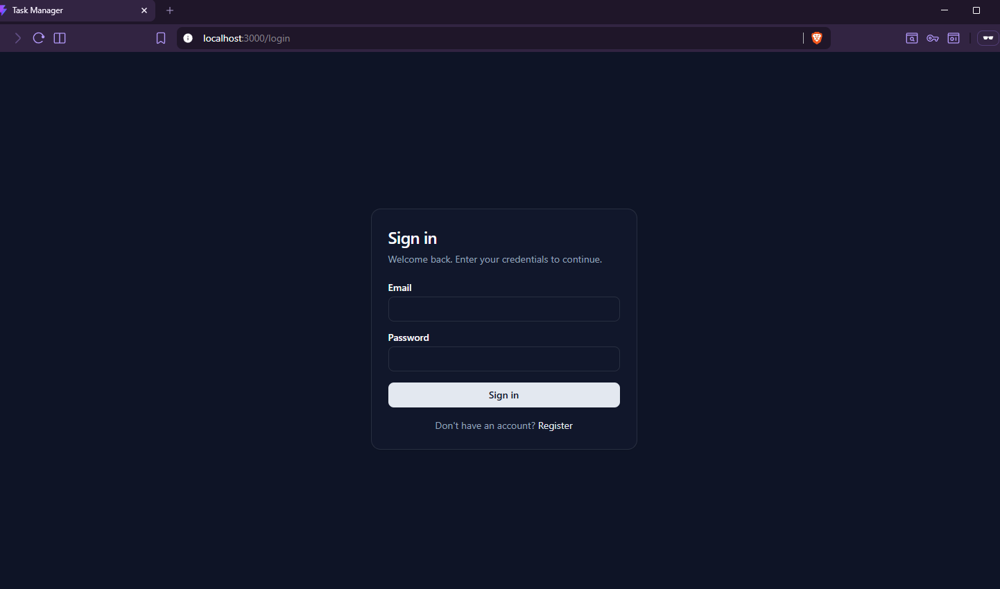
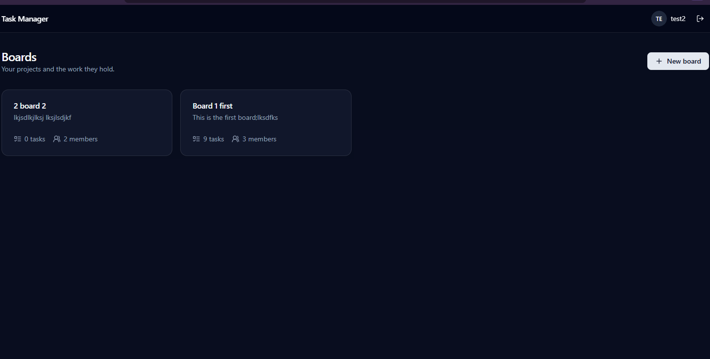
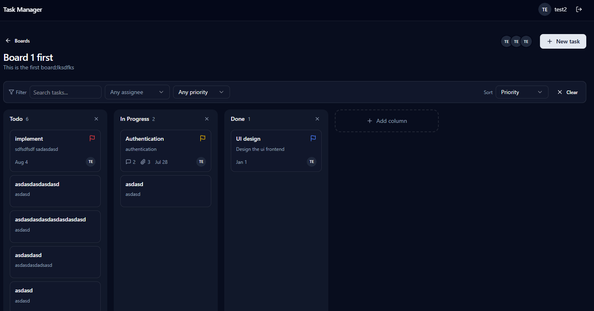
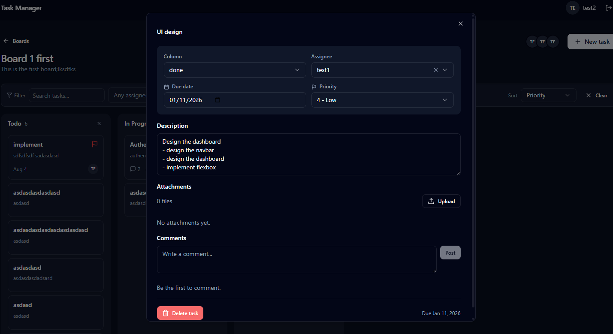
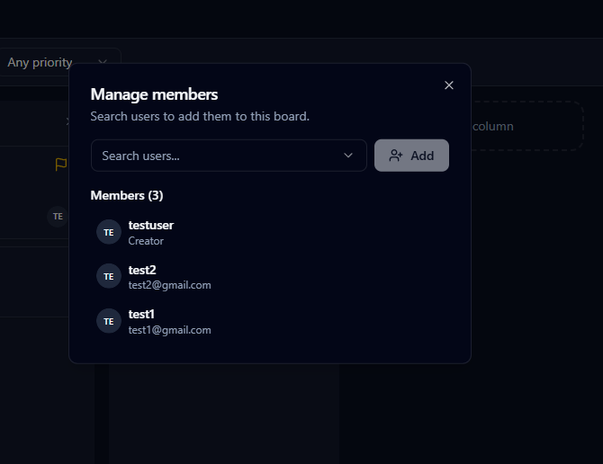
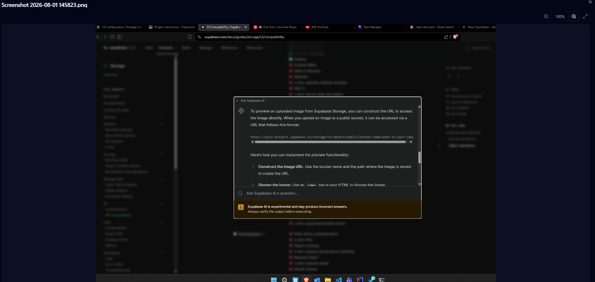

# TaskFlow

A Trello like task and project management app. Organize work into boards, arrange tasks across customizable kanban columns, collaborate with team members, and attach files and comments to any task.

---

## ✨ Features

- **Boards**: create, edit, and delete project boards (owner only for edit/delete)
- **Dynamic kanban columns**: add / remove columns per board (not a fixed To-Do / Doing / Done)
- **Drag & drop**: move tasks between columns with optimistic updates
- **Tasks**: title, description, assignee, due date, and 1 to 5 priority
- **Filtering & sorting**: by assignee, priority, search text, and sort order
- **Team members**: add members by username / email, compact avatar-stack member list
- **Comments**: per-task threaded comments (author-only edit/delete)
- **Attachments**: file uploads with image thumbnails and a full-screen zoom/pan preview
- **Auth**: JWT-based register / login, protected routes

---

## 📸 Screenshots

|                                                          |                                                                  |
| -------------------------------------------------------- | ---------------------------------------------------------------- |
| **Login**                                                | **Dashboard (boards)**                                           |
|                    |                    |
| **Board view (kanban)**                                  | **Task detail**                                                  |
|          |                |
| **Manage members**                                       | **Image attachment preview**                                     |
|  |  |

---

## 🛠️ Tech Stack

**Frontend**

- React 19 + TypeScript, built with Vite
- Tailwind CSS v4 + shadcn/ui (Radix primitives)
- React Router 7, TanStack Query
- react-hook-form + Zod, @dnd-kit for drag & drop
- axios, sonner (toasts), date-fns, lucide-react

**Backend**

- Node.js + Express 5 (TypeScript)
- Prisma 7 with the `@prisma/adapter-pg` driver adapter
- PostgreSQL
- JWT auth (`jsonwebtoken`) + `bcryptjs`
- Zod validation, `multer` for uploads
- Supabase Storage for task attachments

---

## 📂 Project Structure

```
web-project/
├── backend/            # Express + Prisma API
│   ├── routes/         # auth, boards, tasks, comments, attachments, users
│   ├── lib/            # prisma client, validation helper
│   ├── prisma/         # schema + migrations
│   ├── middleware.ts   # JWT auth middleware
│   └── index.ts        # server entry
├── frontend/           # React + Vite SPA
│   └── src/
│       ├── pages/      # login, register, dashboard, board-view
│       ├── components/ # dialogs, kanban, filters, ui/ (shadcn)
│       └── lib/        # api client, queries, auth-context, types
└──docs/screenshots/    # screenshots for this README
```

---

## 🚀 Getting Started

**🌐 Live App:** [_live app_](https://rabindra-task-manager.netlify.app/)

To run locally:

### Prerequisites

- Node.js 20+
- A PostgreSQL database (local install or hosted, e.g. Supabase)

### 1. Backend

```bash
cd backend
npm install
cp .env.example .env        # then edit values (see below)
npx prisma migrate deploy   # apply migrations (or `migrate dev` in development)
npx prisma generate         # generate the Prisma client
npm run dev                 # starts on http://localhost:5000
```

**`backend/.env`**

| Variable                                     | Description                                                   |
| -------------------------------------------- | ------------------------------------------------------------- |
| `DATABASE_URL`                               | PostgreSQL connection string                                  |
| `DATABASE_SSL`                               | `true` when the DB requires SSL (e.g. Supabase), else `false` |
| `JWT_SECRET`                                 | Secret used to sign JWTs (change in production)               |
| `JWT_EXPIRE`                                 | Token lifetime, e.g. `7d`                                     |
| `PORT`                                       | API port (default `5000`)                                     |
| `CORS_ORIGIN`                                | Allowed frontend origin, e.g. `http://localhost:3000`         |
| `SUPABASE_URL` / `SUPABASE_SERVICE_ROLE_KEY` | Required for attachment upload/download via Supabase Storage  |
| `SUPABASE_BUCKET_NAME`                        | Optional bucket name for attachments (default: `attachments`) |

### 2. Frontend

```bash
cd frontend
npm install
cp .env.example .env        # set VITE_API_URL if the API isn't on localhost:5000
npm run dev                 # starts on http://localhost:3000
```

**`frontend/.env`**

| Variable       | Description                                                                                                       |
| -------------- | ----------------------------------------------------------------------------------------------------------------- |
| `VITE_API_URL` | Base URL of the backend API (default `http://localhost:5000`; leave empty for same-origin behind a reverse proxy) |

---

## 📜 Scripts

**Backend**

| Command             | Description                               |
| ------------------- | ----------------------------------------- |
| `npm run dev`       | Start the API with hot reload (tsx watch) |
| `npm run build`     | Compile TypeScript to `dist/`             |
| `npm start`         | Run the compiled server                   |
| `npm run typecheck` | Type-check without emitting               |
| `npm run lint`      | Lint the backend                          |

**Frontend**

| Command           | Description                         |
| ----------------- | ----------------------------------- |
| `npm run dev`     | Start the Vite dev server           |
| `npm run build`   | Type-check and build for production |
| `npm run preview` | Preview the production build        |
| `npm run lint`    | Lint the frontend                   |

---

## 🔌 API Overview

All routes except `POST /api/auth/register` and `POST /api/auth/login` require an
`Authorization: Bearer <token>` header.

- **Auth**: `POST /api/auth/register`, `POST /api/auth/login`, `GET /api/auth/me`
- **Boards**: CRUD 
- **Tasks**: CRUD with `boardId` / `status` / `assignedToId` / `priority` filters
- **Comments**: CRUD (`?taskId=` list; author-only edit/delete)
- **Attachments**: upload / list / download / delete
- **Users**: list all, or members of a board via `?boardId=`

---

## 🔐 Roles & Permissions (summary)

- **Board creator (owner)**: can rename/delete the board, manage columns, and add/remove members, in addition to everything a member can do.
- **Member**: can view the board and create/edit/move/delete tasks, comment, and manage attachments.
- **Comments** are author-scoped: only the author can edit or delete their own comment.
